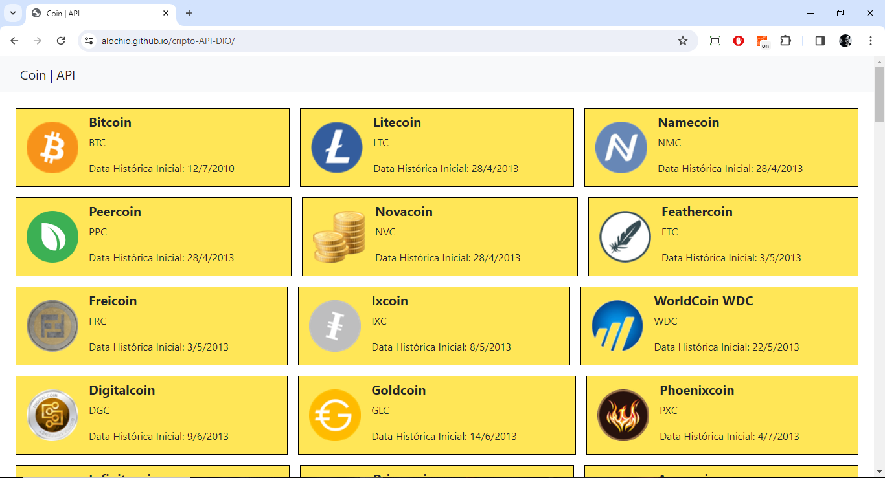

# Site requisitando informações de criptomoedas da API Coinmarketcap

Neste repositório foi criado um site simples, onde a ideia do mesmo era somente solicitar requisições de uma API para alimentar um site.

## Funcionalidades:
- Imprime o nome, código e data de lançamento das moedas.

## Tecnologias Utilizadas:
- HTML
- CSS
- Bootstrap
- [API Coinmarketcap](https://coinmarketcap.com/api/)

## Veja como ficou:
Para conseguir acessar as informações contídas no site, por conta da API é preciso ter instalado no seu computador a extensão no Chorme: [Moesif CORS](https://chromewebstore.google.com/detail/moesif-origin-cors-change/digfbfaphojjndkpccljibejjbppifbc)

Link do GitHub pages: [Cripto | API](https://alochio.github.io/cripto-API-DIO/)

